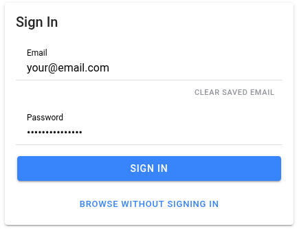
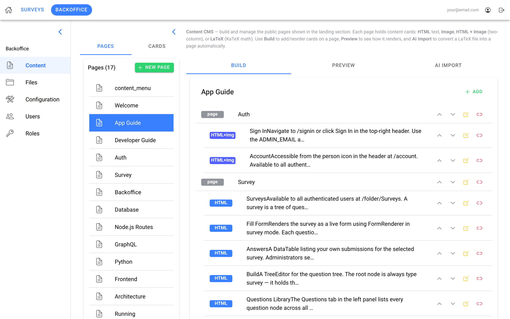
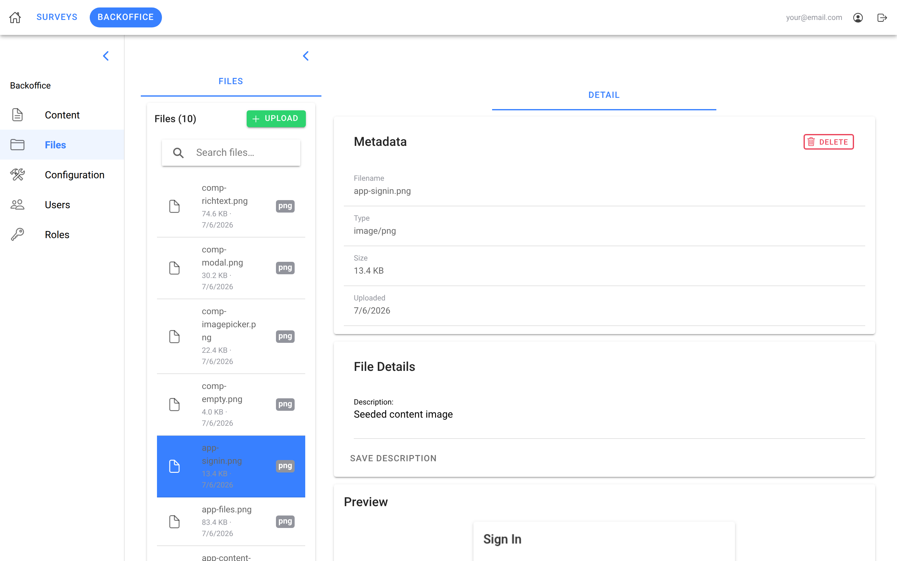
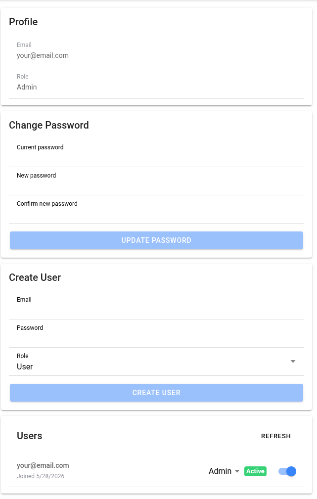
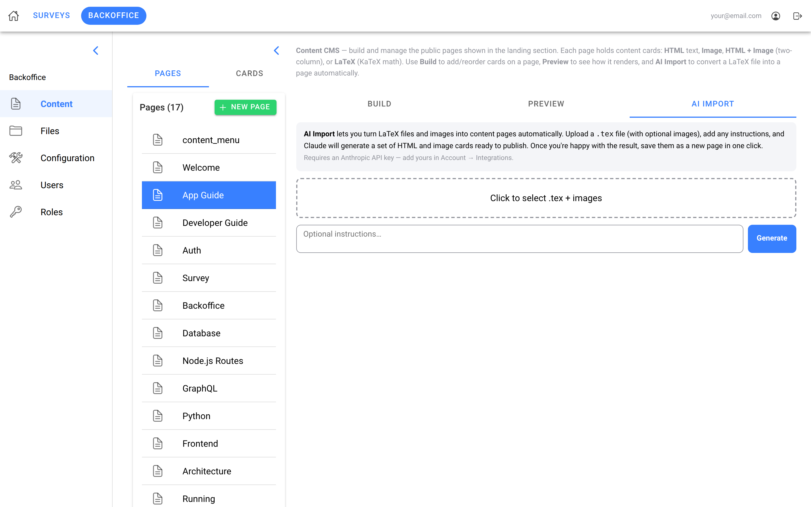
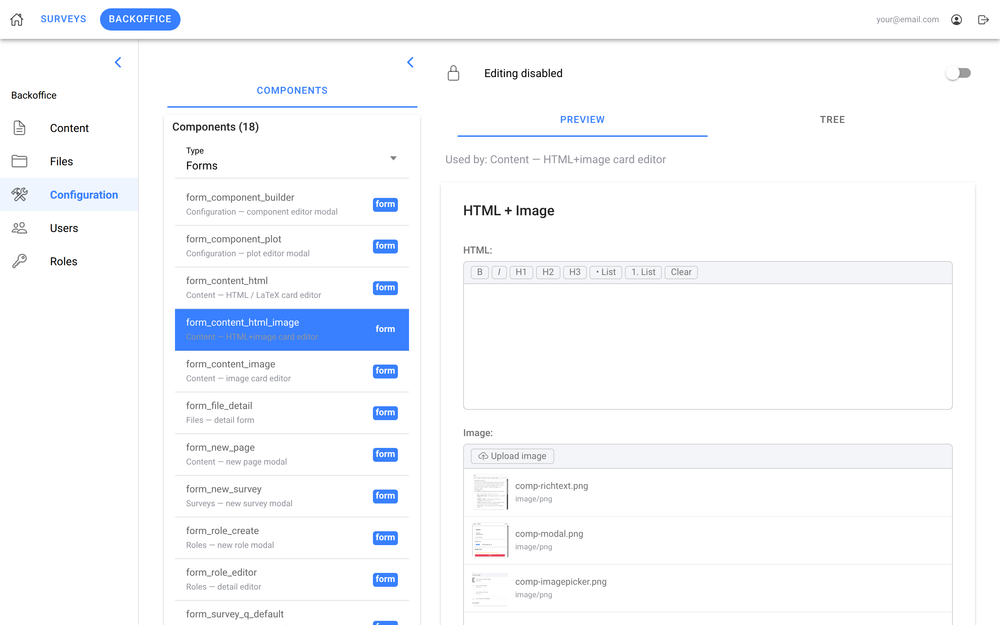

# manuSpine


A full-stack framework for building data-driven web apps. Ships auth with
role tiers, a JSONB component-tree engine that powers dynamic forms, surveys
and a CMS, MinIO file storage, a per-user secrets keychain, and a Python
compute service — one Docker stack for development, a three-stage deploy
pipeline for production.

Fork it, build your app as a domain slice, and keep merging framework
updates from upstream.

---

## Screenshots

| Sign In | Content | Files |
|---------|---------|-------|
|  |  |  |

| Account | AI Import | Config |
|---------|-----------|--------|
|  |  |  |

---

## Stack

```
pwa (React + Ionic + Vite)
  → nodejs (Express + GraphQL + REST)
      → postgres (schema + seeds in init-scripts/)
      → minio (file storage)
  → python (FastAPI, computation only — no DB access)
```

| Layer | Tech | Purpose |
|-------|------|---------|
| Frontend | React + Ionic + Vite | SPA with shell components, routing, auth |
| Backend | Node.js + Express + GraphQL | API, auth, business logic |
| DB | PostgreSQL 16 | Relational store; JSONB for flexible component data |
| Storage | MinIO | Object storage for files / images |
| Computation | Python + FastAPI | Domain-specific compute; Node.js proxies here |

---

## Framework features

- **Component tree system** — UI structure (forms, inputs, selects, plots)
  stored as JSONB nodes in the DB. `FormRenderer` turns a tree into a live
  form; admins build and edit trees with `TreeEditor` in the backoffice.
- **Survey system** — a parallel component tree for authoring and running
  surveys. Answers are keyed by component UUID and owner-scoped: users see
  their own submissions, admins see all.
- **Content / CMS** — hierarchical content pages with HTML, Image,
  HTML+Image and LaTeX card types, edited from the backoffice. Optional AI
  import turns pasted LaTeX into content cards (Anthropic API).
- **Files** — MinIO-backed upload, listing and description management.
  Seeded images survive DB resets via stable object keys.
- **Auth & roles** — JWT login; roles alias onto four permission tiers
  (`public` / `registered` / `user` / `admin`). Every GraphQL operation is
  admin-only unless deliberately opened in `permissions.js`, and roles are
  managed from the backoffice.
- **Secrets keychain** — per-user encrypted secrets (AES-256-GCM). Declaring
  a key name in the registry is the whole change: storage, API and the
  Account Integrations UI follow from it.
- **Shell components** — `SplitPageLayout`, `SinglePanelLayout`,
  `AreaShell`, `ResourcePanel`, `DataTable`, `TabPanel`, `ModalShell`,
  `TreeEditor`, `EmptyState`, `JsonViewer`, `PdfViewer`, plus `EChart` for
  charts — the building blocks every page composes.

---

## Development

```bash
cp .env.example .env          # set credentials first
./run                         # start all services
./run down                    # stop everything
./run rebuild [service]       # rebuild after Dockerfile/deps changes (all if omitted), then start
./run reset                   # wipe DB + MinIO and restart (re-runs init-scripts)
./run rebuild-reset [service] # wipe DB + MinIO AND rebuild, then start
```

Every form ends in a foreground `docker compose up` — Ctrl-C tears the
stack down. A background poller prints a `STACK READY` banner once all
three services answer (the pwa dev server lags a rebuild by minutes).

Service URLs:
- Frontend: http://localhost:8100 — sign in with `ADMIN_EMAIL` / `ADMIN_PASSWORD`
- GraphQL: http://localhost:3000/graphql
- Python: http://localhost:5000

---

## Building an app

manuSpine is an upstream framework: your app lives in a fork and keeps
pulling framework updates.

1. Fork the repo and clone your fork.
2. Add the framework as a remote: `git remote add upstream <manuSpine url>`.
3. Build your features as a **domain** (below) — framework files stay
   untouched, so merges stay clean.
4. Pull framework updates with `git fetch upstream && git merge
   upstream/master` — never cherry-pick.

### Adding a domain

A domain is a vertical slice of functionality. It touches five places,
each mirroring the framework layout:

1. **DB** — `init-scripts/02-init-<domain>.sql` (picked up alphabetically
   on a fresh volume; `./run reset` applies it).
2. **REST routes** — `nodejs/routes/<domain>/`, registered in `backend.js`.
3. **GraphQL** — `nodejs/schema/resolvers/<domain>/`, merged in
   `schema/index.js`; open operations to lower tiers in `permissions.js`.
4. **Python** (optional) — `python/api/domains/<domain>/routes.py`,
   included in `main.py`.
5. **Frontend** — pages in `pwa/src/pages/<domain>/`, constants in
   `constants.ts`, routes in `App.tsx`, nav in `Menu.tsx`.

The seeded **Developer Guide** (Landing page → Developer Guide, after
signing in) walks through the full slice with code.

---

## Production

`docker-compose.prod.yml` runs four services — the PWA is built to static
files and served by the edge proxy instead of a dev server — on prebuilt
`:prod` images with no published ports, split across `edge` / `internal` /
`db` networks.

Deployment is three idempotent stages; all images are built off-box (the
server carries no build tooling):

1. `deploy/provision.sh` — one-time server prep: Docker, log rotation, SSH
   hardening, unattended upgrades, swap, the shared `edge` network and the
   Caddy skeleton.
2. `deploy/ship-caddy.sh` — build and ship the Caddy front door (wildcard
   TLS via DNS-01).
3. `deploy/ship-app.sh` — build the prod images and static PWA, ship them
   to `/srv/apps/<app>`, and start the stack.

Hostnames and secrets live only on the box; `.env.prod.example` is the
committed template.

---

## Claude Code tooling

The repo ships a `.claude/` layer for [Claude Code](https://claude.com/claude-code)
users: skills that automate the common workflows (`new-api`, `new-form`,
`new-page`, `seed-content`, `pull-upstream`, …), review agents
(convention-reviewer, exposure-auditor, pattern-scout, …), path-scoped
coding rules, and a versioned project memory. `CLAUDE.md` is the entry
point.

---

## License

[MIT](LICENSE)
