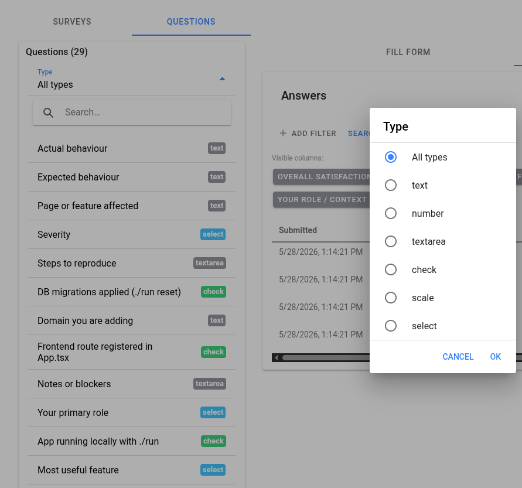
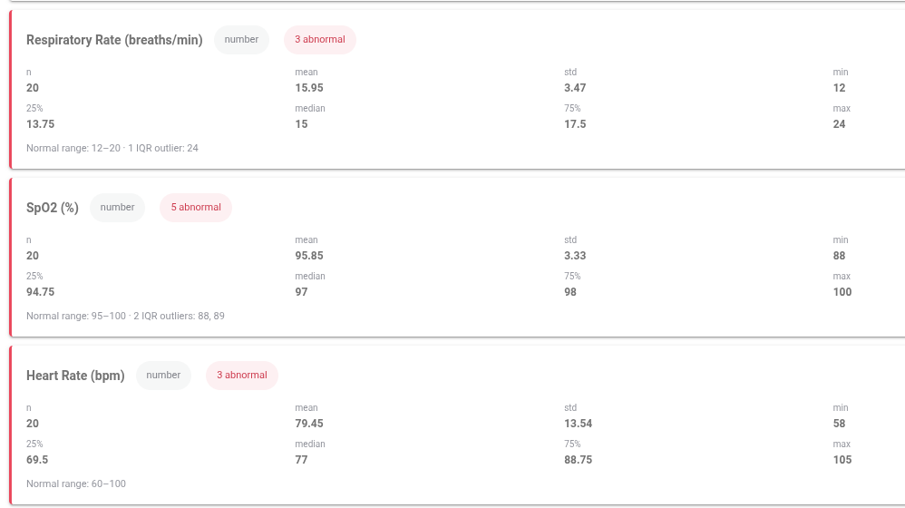

# manuBeat


A cardiovascular modelling and simulation platform demonstrating the **Embedded Gradient Descent (EGD)** calibration framework for mechanistic ODE-based cardiovascular models. Built on the [ManuSpine](https://github.com/mtc8608-Org/ManuSpine) full-stack framework.

---

## Research

manuBeat is the development and demonstration environment for **ICUTwin** — a closed-loop lumped-parameter cardiovascular digital twin — and the EGD calibration strategy that drives it.

**EGD** calibrates ODE-based cardiovascular models by promoting selected parameters to dynamic states and embedding controller equations that drive them toward prescribed haemodynamic targets. This exploits the qualitative structure of the governing equations to enforce physiologically consistent parameter–variable relationships, yielding unique solutions that are robust to initial conditions and scale efficiently with model complexity.

The framework is described in full in the paper:

> *A Physiologically Constrained Calibration Framework for Cardiovascular Models applied in Paediatric Sepsis*  
> MT Cabeleira, S Ray, NC Ovenden, V Diaz-Zuccarini — UCL / Great Ormond Street Hospital

The full paper is rendered as content in the running application under **EGD Paper**.

---

## Screenshots

| Sign In | Surveys | Content |
|---------|---------|---------|
|  |  |  |

| Stats | Files | Config |
|-------|-------|--------|
|  |  |  |

---

## What's included

### Platform stack

| Layer | Tech | Purpose |
|-------|------|---------|
| Frontend | React + Ionic + Vite | SPA with shell components, routing, auth |
| Backend | Node.js + Express + GraphQL | API, auth, business logic |
| DB | PostgreSQL 16 | Relational store; JSONB for flexible component data |
| Storage | MinIO | Object storage for files / images |
| Computation | Python + FastAPI | Cardiovascular simulation engine; Node.js proxies here |

### Framework features

- **Component tree system** — UI structure (forms, inputs, charts) stored as JSONB nodes. Rendered dynamically by `FormRenderer` / `TreeEditor`.
- **Survey system** — parallel component tree for building and running surveys with answer storage.
- **Content / CMS** — hierarchical content pages with HTML, Image, HTML+Image, and LaTeX card types. Editable from the Backoffice.
- **Files** — MinIO-backed file upload, listing, and description management.
- **Auth** — JWT-based login, roles (`admin` / `user`), change-password.
- **Shell components** — `SplitPageLayout`, `TabPanel`, `ResourcePanel`, `DataTable`, `ModalShell`, `EmptyState`, `TreeEditor`.

### Medical domain

- **Cardiovascular model** — closed-loop nine-compartment lumped-parameter ODE model (ICUTwin) implemented in Python/JAX with explicit Euler integration.
- **EGD calibration** — embedded controller equations that calibrate model parameters to prescribed haemodynamic targets in real time during simulation.
- **Simulation engine** — FastAPI routes exposing the model runner; results stored as HDF5 via the HDF5 engine and served back to the frontend.
- **Simulator page** — browser-based interface for configuring and running simulations, inspecting results, and visualising time-series outputs.
- **EGD Paper** — full manuscript rendered in-browser as content cards (abstract, introduction, model equations, calibration framework, convergence analysis, population results with all figures).

---

## Running

```bash
cp .env.example .env          # edit credentials
./run                         # start all services
./run reset                   # wipe DB + MinIO and restart (re-runs init-scripts)
./run rebuild <service>       # rebuild after Dockerfile changes
./run down                    # stop everything
```

Service URLs:
- Frontend: http://localhost:8100
- GraphQL: http://localhost:3000/graphql
- Python: http://localhost:5000

---

## Adding a domain

A domain is a vertical slice of functionality. Each domain adds five files in predictable locations — mark every addition with `// [MY DOMAIN]` (or `-- [MY DOMAIN]` in SQL) so domain code can be found by a single grep.

### 1. DB tables — `init-scripts/02-init-<domain>.sql`

```sql
CREATE TABLE my_things (
  id UUID PRIMARY KEY DEFAULT gen_random_uuid(),
  name TEXT NOT NULL,
  created_at TIMESTAMPTZ DEFAULT now()
);
```

Picked up alphabetically by Postgres on first start. Run `./run reset` to apply.

### 2. Node.js routes — `nodejs/routes/<domain>/things.js`

```js
const router = require('express').Router();
const { pool } = require('../../db');
// ... REST endpoints
module.exports = router;
```

Register in `nodejs/backend.js`:
```js
server.use('/api', require('./routes/<domain>/things')); // [MY DOMAIN]
```

### 3. GraphQL resolvers — `nodejs/schema/resolvers/<domain>/things.js`

```js
module.exports = { queries: { /* ... */ }, mutations: { /* ... */ } };
```

Register in `nodejs/schema/index.js` by spreading into the `Query` and `Mutation` fields.

### 4. Python routes (optional) — `python/api/domains/<domain>/routes.py`

```python
from fastapi import APIRouter
router = APIRouter()

@router.get("/<domain>/health")
def health(): return {"ok": True}
```

Register in `python/api/main.py`:
```python
from .domains.<domain>.routes import router as domain_router
app.include_router(domain_router)
```

### 5. Frontend — `pwa/src/pages/<domain>/`

- Add page files following the `SplitPageLayout` pattern.
- Add constants to `pwa/src/constants.ts` marked `// [MY DOMAIN]`.
- Register routes in `pwa/src/App.tsx` and nav in `pwa/src/components/shell/Menu.tsx`.
